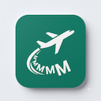

# 国泰航空奖励里程航班查询插件 / Cathay Award Flight Finder

[中文](#中文) | [English](#english)

一个强大的 Chrome 浏览器扩展，帮助你快速查询国泰航空奖励里程可用航班。轻松找到最佳兑换机会，节省你的搜索时间。

A powerful Chrome extension for finding Cathay Pacific award flights with ease. Quickly search available redemption flights and save your time.

---

## 功能特点 / Features

✨ **功能亮点**

- 🎯 **快速查询面板** - 在国泰航空页面中添加便捷的搜索工具
  - Quick Query Panel - Adds a convenient search tool on Cathay Pacific pages
  
- 💾 **智能记忆** - 自动保存你上次的搜索条件
  - Smart Memory - Automatically saves your last search preferences
  
- 📅 **批量查询** - 支持一次查询多个日期和机场代码
  - Batch Search - Support for multiple dates and comma-separated airport codes
  
- 💰 **里程显示** - 实时展示可用舱位和所需里程数
  - Points Display - Shows available cabins and required points in real-time

---

## 功能演示 / Demo

### 截图展示 / Screenshots

---

## 快速开始 / Quick Start

### 中文

#### 本地安装（开发者模式）

1. 打开 Chrome 浏览器
2. 访问 `chrome://extensions/`
3. 启用右上角的"开发者模式"开关
4. 点击"加载已解压的扩展程序"
5. 选择本项目文件夹，确认即可

#### 使用说明

1. 访问 [Cathay Pacific 官网](https://www.cathaypacific.com)
2. 点击扩展图标即可打开查询面板
3. 输入出发地、目的地、日期等信息
4. 系统会自动保存你的偏好设置
5. 支持批量查询：用逗号分隔多个机场代码或日期范围

### English

#### Local Installation (Developer Mode)

1. Open Chrome browser
2. Navigate to `chrome://extensions/`
3. Toggle "Developer mode" in the top right corner
4. Click "Load unpacked"
5. Select this project folder and confirm

#### How to Use

1. Visit [Cathay Pacific official website](https://www.cathaypacific.com)
2. Click the extension icon to open the query panel
3. Enter departure city, destination, date and other details
4. The system will automatically save your preferences
5. Supports batch queries: use commas to separate multiple airport codes or date ranges

---

## 安装到 Chrome Web Store / Chrome Web Store Installation

### 打包步骤 / Packaging Steps

准备上传到 Chrome Web Store？请按照以下步骤打包：

Ready to publish on Chrome Web Store? Follow these steps:

1. 确保包含以下文件 / Make sure to include:
   - `manifest.json` - 扩展配置文件 / Extension configuration
   - `content.js` - 核心脚本 / Core script
   - `icons/` - 图标目录 / Icons directory
   - `README.md` - 说明文档 / Documentation
   - `PRIVACY.md` - 隐私政策 / Privacy policy

2. 压缩上述文件夹内容到 ZIP 文件
   / Zip the above folder contents

3. 访问 [Chrome Web Store 开发者后台](https://chrome.google.com/webstore/devconsole)
   / Visit [Chrome Web Store Developer Dashboard](https://chrome.google.com/webstore/devconsole)

4. 上传 ZIP 文件并提交审核
   / Upload ZIP file and submit for review

---

## 隐私和安全 / Privacy & Security

- 🔒 **本地存储** - 所有数据保存在你的浏览器本地，不上传任何数据
  - Local Storage - All data stored locally on your browser, no data uploaded
  
- 📄 查看完整隐私政策 / View full [Privacy Policy](./PRIVACY.md)

---

## 支持的浏览器 / Supported Browsers

- Chrome 90+
- Chromium 90+
- Microsoft Edge 90+
- Brave Browser

---

## 常见问题 / FAQ

**Q: 数据会被保存吗？**
A: 是的，你的搜索条件会保存在本地浏览器存储中，方便下次快速查询。

**Q: Does the extension save my data?**
A: Yes, your search preferences are saved in local browser storage for quick access next time.

---

## 许可证 / License

MIT License - 查看 [LICENSE](./LICENSE) 了解详情
/ See [LICENSE](./LICENSE) for more details

---

## 反馈和支持 / Feedback & Support

发现 Bug 或有改进建议？欢迎提交 Issue！
/ Found a bug or have suggestions? Welcome to submit an issue!

**GitHub**: [guotai-plugin](https://github.com/kaka169aus-ux/guotai-plugin)

---

## 详细说明 / Detailed Description

### 中文版 / Chinese

本扩展通过注入脚本到国泰航空网站，为用户提供更便捷的奖励里程航班查询体验。所有用户数据均存储在本地浏览器中，确保隐私安全。

**主要优势：**
- 无需反复输入搜索条件
- 支持快速批量查询
- 直观展示可用选项
- 完全免费使用

### English Version / 英文版

This extension enhances the Cathay Pacific website by injecting functionality to provide a more convenient award flight search experience. All user data is stored locally on the browser, ensuring privacy and security.

**Key Advantages:**
- No need to repeatedly enter search criteria
- Support for quick batch queries
- Intuitive display of available options
- Completely free to use
